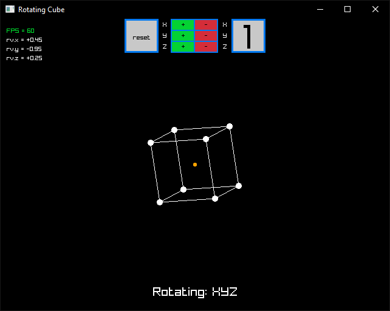

# Cubo dando vueltas - Internal Matematica NM
Un cubo en tres dimensiones programado en C con la libreria de videojuegos Raylib, utilizando matrices.

## Links

**Software Rendered 3D in Java Tutorials with Processing:**
1. [Matrix Multiplication for 3D Rendering](https://www.youtube.com/watch?v=tzsgS19RRc8)
2. [3D Rendering with Rotation and Projection](https://www.youtube.com/watch?v=p4Iz0XJY-Qk)

**Wikipedia Page for Rotation Matrices:**
- [Rotation Matrix](https://en.wikipedia.org/wiki/Rotation_matrix)

**2D array mapping**
- [Beginner C++ Game Programming DirectX [2D Arrays / Circular Dependency] Tutorial 21](https://www.youtube.com/watch?v=Zbw58vTotok&ab_channel=ChiliTomatoNoodle)
- [Multidimensional arrays are evil - Article](http://www.cplusplus.com/forum/articles/17108/)