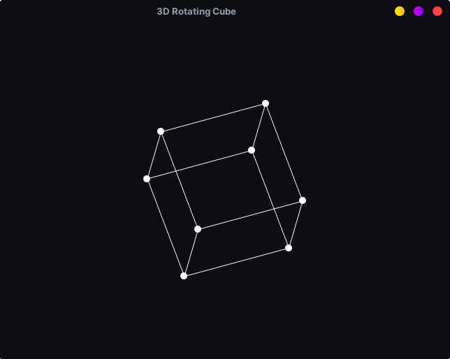

# Cube
A rotating 3D cube made using C++, SFML and matrix multiplication.

- I used java, [processing](https://processing.org/) tutorials from [TheCodingTrain](https://www.youtube.com/c/TheCodingTrain) and translated them to C++ and [SFML](https://www.sfml-dev.org/).

## Links

**Software Rendered 3D in Java Tutorials with Processing:**
1. [Matrix Multiplication for 3D Rendering](https://www.youtube.com/watch?v=tzsgS19RRc8)
2. [3D Rendering with Rotation and Projection](https://www.youtube.com/watch?v=p4Iz0XJY-Qk)

**Wikipedia Page for Rotation Matrices:**
- [Rotation Matrix](https://en.wikipedia.org/wiki/Rotation_matrix)

**2D array mapping**
- [Beginner C++ Game Programming DirectX [2D Arrays / Circular Dependency] Tutorial 21](https://www.youtube.com/watch?v=Zbw58vTotok&ab_channel=ChiliTomatoNoodle)
- [Multidimensional arrays are evil - Article](http://www.cplusplus.com/forum/articles/17108/)

## WARNING

I know almost nothing about 3D graphics and this is a beguinner project. Therefore this are the issues:

- Some of the code is a mess and not well documented.
- I didn't fully understood some of the matrices. For example the __rotation matrices__ are hard.

## Structure

There is only one translation unit, or `.cpp` file, and the code is divided into header files with utilities for matrices, vectors, shapes, etc.
A couple of them contain namespaces to separate specific definitions/symbols in scopes, and I removed the need of using 2D arrays and double pointers by abstracting away a one-dimensional array that represents a 2D array, in a class called `Matrix`.

The folder `math3D` contains the header files that were coded with the help of the mentioned tutorials. `math3D.h` contains all the `.hpp` files in the respective folder.

- `shapes.hpp` contains a namespace with helper functions to draw shapes with SFML.

- `matrix.hpp` contains a matrix class with a scoped-heap-allocated array. It overloads the `operator()` to be used as a 2D array (which in reality is a one-dimensional array). Instead of writing `projection[0][0]`, you would write `projection(0,0)`.

- `window.hpp` has a struct with variables for the window widht, height, and the half of each.

- `matrices.hpp` has a namespace with `Matrix` instances used for projection and rotations. It also has helper functions for matrix multiplication, and to log matrices. I removed the perspective projection, but with the cleanup I could probably implement it this time.

- `vector.hpp` has a _vector class_ with members used for 3D vector coordinates. It overloads the `operator()` to be used as an array. Instead of writing `v[0]`, you would write `v(0)`.

## Dependencies

You need a C++ toolchain with a compiler and linker, such as MSVC, g++, clang, etc. You also need to download the SFML binaries of your respective operating system and compiler, and link statically or dynamically, according to your personal preference. I got lazy and used my linux package manager, hence why my makefile doesn't set the include path for the SFML library. **Don't use my makefile** unless you are using the same setup as mine. On the releases page there is a linux binary anyway.
